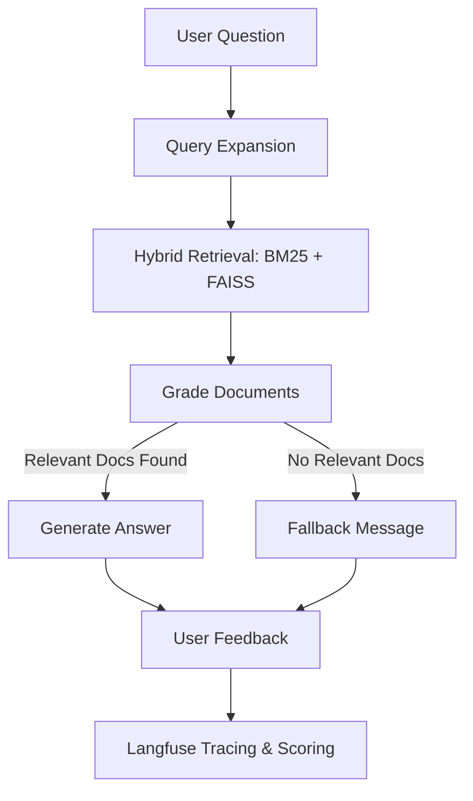

# 🤖 Advanced PDF RAG Chatbot (v2.0)

An industry-grade **Retrieval-Augmented Generation (RAG)** system built with a **LangGraph** stateful pipeline, **FastAPI** backend, and **React/Vite** frontend. This version features advanced observability (LLMOps) and a self-correcting RAG architecture.

---

## 🏗️ Architecture Overview

The system transitions from a simple linear script to a **Stateful Graph** for higher reliability and accuracy.



### 🛣️ Detailed Processing Pipeline

1.  **Ingestion Phase**:
    *   **Extraction**: Text is extracted from PDF pages using `PyPDF2`.
    *   **Chunking**: Text is split into overlapping chunks (500 chars) using `RecursiveCharacterTextSplitter` to maintain context.
    *   **Indexing**: Chunks are stored in a **FAISS** vector store (Semantic) and a **BM25** index (Keyword).

2.  **Query Phase (LangGraph)**:
    *   **Expansion**: The LLM generates 3 variations of the user question to capture different keywords.
    *   **Ensemble Retrieval**: Both FAISS and BM25 are queried. Results are combined using **Reciprocal Rank Fusion (RRF)**.
    *   **Relevance Grading**: A "Grader LLM" checks every chunk. Irrelevant chunks (noise) are discarded.

3.  **Completion Phase**:
    *   **Synthesis**: The LLM generates a final response using *only* the verified chunks and previous chat context.
    *   **Observability**: The entire trace is sent to **Langfuse** for performance monitoring.

---

## 🌟 Key Features

### 1. LangGraph Stateful Pipeline (`rag_graph.py`)
*   **Pre-retrieval (Query Expansion)**: Rewrites the user query into multiple search perspectives to bridge the semantic gap.
*   **Ensemble Retrieval**: Combines **Keyword Search (BM25)** and **Semantic Search (FAISS)** for better recall.
*   **Document Grading**: An LLM-based "Self-Correction" step that filters out irrelevant document chunks before generation.
*   **Hallucination Prevention**: Uses a fallback mechanism if no relevant context is found in the uploaded document.

### 2. LLMOps & Observability (`llmops_config.py`)
*   **Real-time Tracing**: Integrated with **Langfuse** to track latency, token usage, and logical paths for every request.
*   **User Feedback Loop**: Thumbs up/down system linked to specific LLM traces via **Langfuse Scores**.
*   **Local Feedback Logging**: All interactions and feedback are persisted to `feedback_log.jsonl`.
*   **Evaluation Suite**: Includes tools to run systematic benchmarks and track experiment results.

### 3. Modern Tech Stack
*   **Backend**: FastAPI, Uvicorn, LangChain, LangGraph.
*   **LLM**: Groq (Llama-3.1-8b-instant).
*   **Embeddings**: HuggingFace (`all-MiniLM-L6-v2`).
*   **Frontend**: React (Tailwind-style Vanilla CSS, Lucide Icons).

---

## 🚀 Setup & Installation

### 1. Prerequisites
*   Python 3.9+
*   Node.js & npm
*   [Groq API Key](https://console.groq.com/)
*   [Langfuse Keys](https://cloud.langfuse.com/) (Optional for tracing)

### 2. Backend Setup
1.  **Clone & Navigate**:
    ```bash
    cd chatbot1.0
    ```
2.  **Virtual Env**:
    ```bash
    python -m venv venv
    venv\Scripts\activate  # Windows
    source venv/bin/activate  # Mac/Linux
    ```
3.  **Install Dependencies**:
    ```bash
    pip install -r requirements.txt
    ```
4.  **Environment Variables**: Create a `.env` file:
    ```env
    GROQ_API_KEY=gsk_...
    LANGFUSE_PUBLIC_KEY=pk-lf-...
    LANGFUSE_SECRET_KEY=sk-lf-...
    LANGFUSE_HOST=https://cloud.langfuse.com
    ```

### 3. Frontend Setup
```bash
cd frontend
npm install
npm run dev
```

---

## 🏃 Running the App

### Development Mode (Recommended)
*   **Terminal 1 (Backend)**: `uvicorn main:app --reload --port 8000`
*   **Terminal 2 (Frontend)**: `npm run dev` (Runs at http://localhost:5173)

---

## 🗺️ Project Roadmap

- [x] **Phase 1**: Basic RAG with FAISS (MVP).
- [x] **Phase 2**: Hybrid Search (BM25 + FAISS) for better accuracy.
- [x] **Phase 3**: Self-Correcting Architecture with **LangGraph**.
- [x] **Phase 4**: LLMOps integration (Langfuse) and User Feedback.
- [ ] **Phase 5**: Multi-modal support (Extracting tables/images from PDFs).
- [ ] **Phase 6**: Persistent Database (Replacing in-memory sessions with PostgreSQL/Redis).
- [ ] **Phase 7**: User Authentication & Cloud Deployment.

---

## 📝 Important Interview Q&A (Technical)

### 1. What is the benefit of using LangGraph over a standard LangChain chain?
> **Answer**: Standard chains are linear. LangGraph allows for **cycles** and **conditional logic**. In this project, it allows us to "grade" documents and route the flow differently based on relevance, mimicking a human's reasoning process (Self-RAG).

### 2. Why use Hybrid Search (BM25 + FAISS) instead of just Vector Search?
> **Answer**: Vector search (FAISS) is great for semantic meaning but often fails on specific keywords, IDs, or rare technical terms. BM25 (Keyword search) excels at finding these exact matches. Combining them with an **Ensemble Retriever** gives the best of both worlds.

### 3. How do you ensure the LLM doesn't hallucinate when it can't find the answer?
> **Answer**: Through **Document Grading**. Our graph has a node that explicitly asks an LLM if the retrieved chunks contain information relevant to the question. If the "relevant_docs" list is empty, we route to a "Fallback" node instead of the "Generate" node.

### 4. What is LLMOps and why did you implement it here?
> **Answer**: LLMOps is about managing the lifecycle and performance of LLMs. I implemented **Tracing** (via Langfuse) to monitor latency and costs, and **Feedback Scoring** to understand user satisfaction. This data is critical for debugging why certain queries fail in production.

### 5. What are Embeddings and how do they work in this project?
> **Answer**: Embeddings are numerical representations (vectors) of text. We use `all-MiniLM-L6-v2` to convert PDF chunks into vectors. When a user asks a question, we convert that question into a vector and use **Cosine Similarity** (via FAISS) to find the most similar document chunks.

---

## 📊 API Endpoints

| Method | Endpoint | Description |
| :--- | :--- | :--- |
| `POST` | `/upload` | Upload PDF and create a session |
| `POST` | `/ask` | Query the RAG graph |
| `POST` | `/feedback` | Submit thumbs up/down feedback |
| `GET` | `/sessions` | List active document sessions |
| `GET` | `/feedback-stats` | View aggregate satisfaction data |

---
*Created by [Your Name/Brand]*
